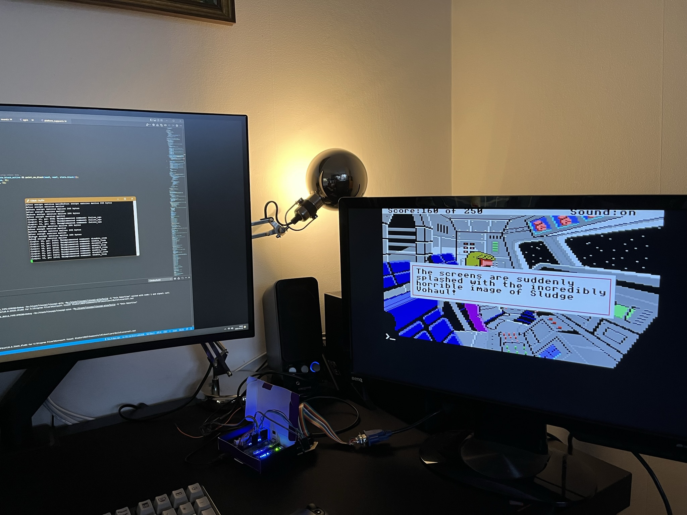

# Tiny AGI

Interpreter for Sierra On-Line's AGI games. Mainly for the Raspberry PI Pico.

Its source was supposed to be TINY - but then it grew. Still, the amount of memory this interpreter consumes should be minimal. That's the design goal now.

The Raspberry PI Pico only has 256 KB (KB) of memory - and in that the framebuffer has to fit as well.

This currently runs on the PI Pico and you can play SQ2 from start to finish. A couple of non-gameplay-breaking bugs still exists. Large VIEWs are still too slow on this platform so that remains to be optimized - you may experience view not rendering, rendering in half or something like that.

The PI Pico version requires a specific hardware setup. I'll post schematics later. To retain performance, it also requires reads input over RS232 serial - serial over USB is too slow right now.

For development purposes, there is also a GLFW version that runs on Windows. That version doesn't have any sound at the moment.

